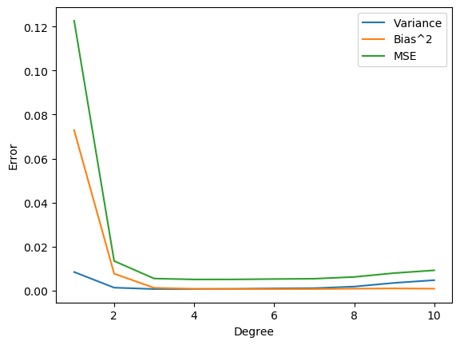

# This repository contains the source code for a basic linear regression model using sci-kit learn library from my second year (February 2023).

## The linear classifier was made for 15 different degrees of poylnomials and the results were compared.

## Submission
- The submission for this project is a Jupyter Notebook (.ipynb) `code.ipynb` containing the source code used in the model. The notebook is available in the repository above.
- `test_dataset.pickle` and `train_dataset.pickle` are the datasets used for testing and training the model.